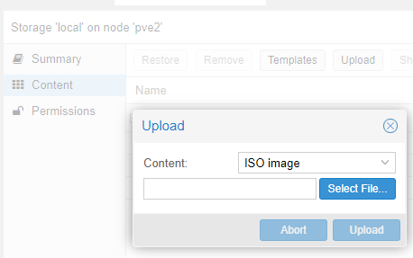
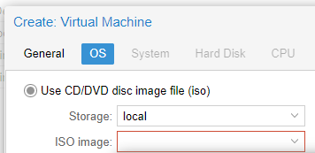
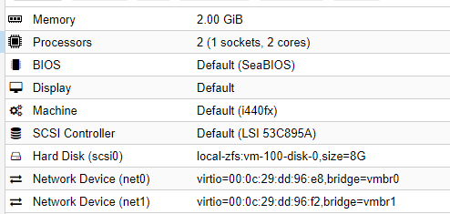
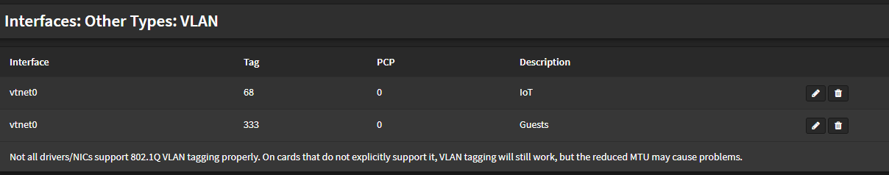
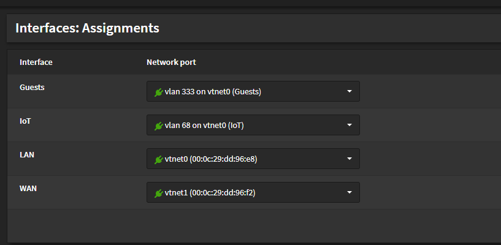
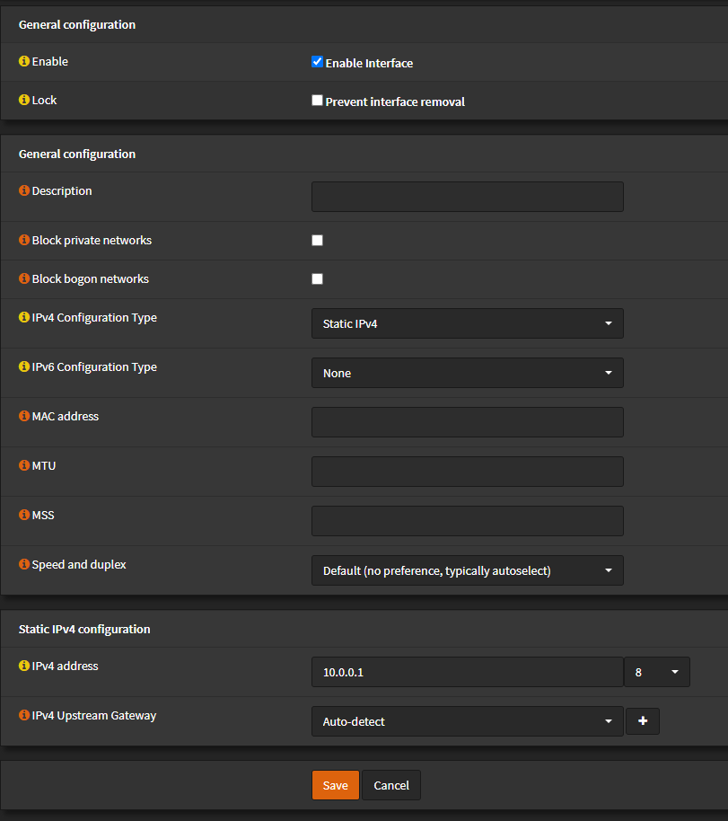
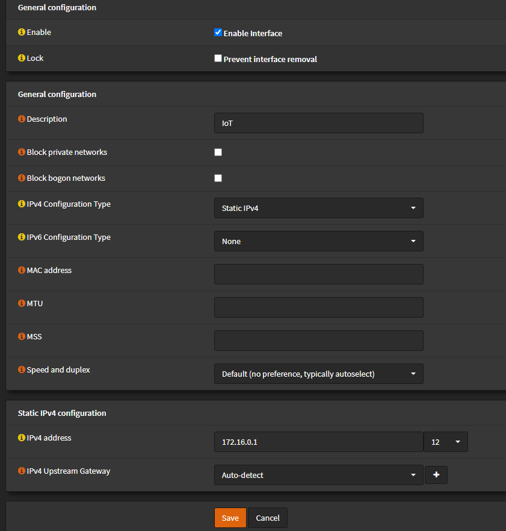
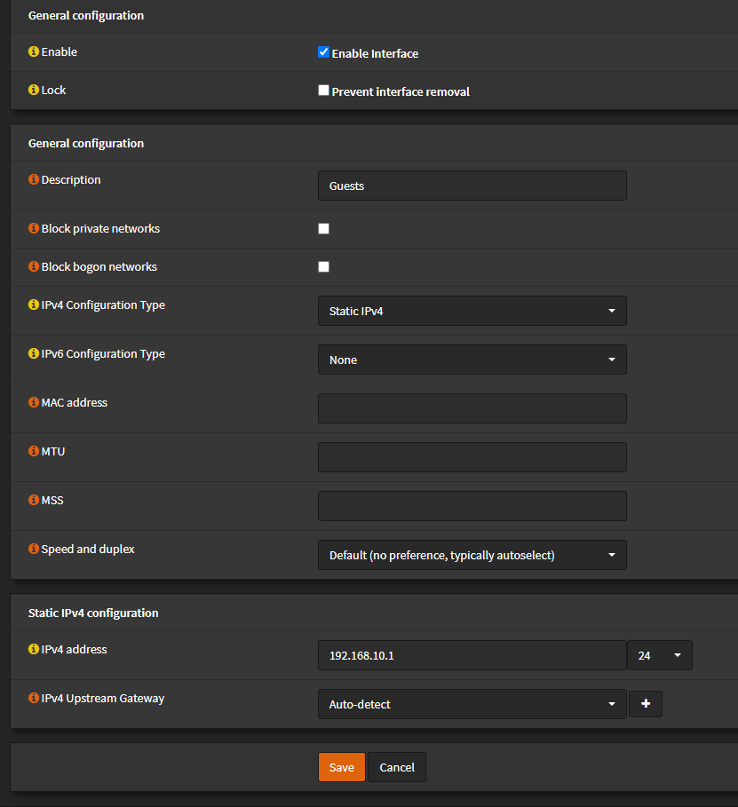
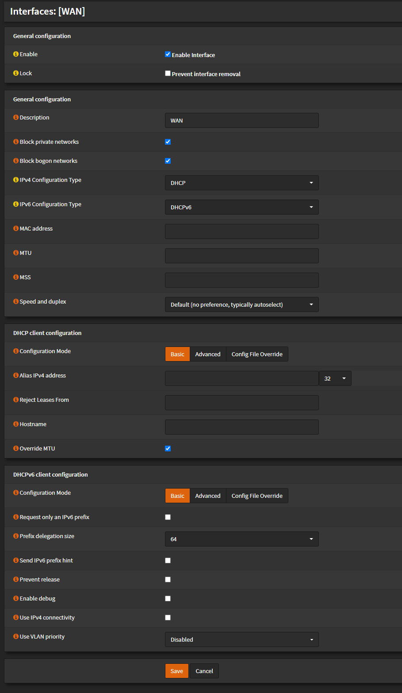

# Create OPNSense Instance

OPNSense and PFSense are very similiar, but I installed OPNSense, because OpenSource.

## Download OPNsense

It can be downloaded from their [Website](https://opnsense.org/download) (choose amd64,dvd)

Then, upload the ISO to the Promox Host "local" storage

## Create a new Proxmox VM

Click on CreateVM and choose the ressource as you please.
You must select the ISO you just uploaded

I use those settings:

make sure you have at least 2 Network cards, one for the LAN-port and one to the WAN-port of your host

## Install OPNSense

Follow the [instructions](https://docs.opnsense.org/manual/install.html) to install
If you want to install pfsense, [instructions](https://docs.netgate.com/pfsense/en/latest/virtualization/virtualizing-pfsense-with-proxmox.html) are available, too.

### initial setup

you can see the console within proxmox and verify (option 1) that the LAN address is matching the LAN port and the WAN is dhcp to the internet.

Use the option 2 to make sure the WAN interface is using DHCP(client) and the LAN interface is setup to be a DHCP Server (in my case, for 10.0.0.0/8).

reboot when finished. Then log into the webGui and finish the configuration wizard.

## Assign IP Addresses

menu->services->dhcpv4->interface: the little plus gives you the option to use a fixed IP for the mac-address.

# My Setup

You should have a plan for your IP addresses. My logic for IP address is like that:

## VLANs

## Interfaces

### Interface LAN

    - 10.0.0.0/24 for infrastructure
    - 10.0.1.0/24 for all Server
    - 10.0.2.0/24 for Proxmox
    - 10.0.9.0/24 for computer in my LAN
    - 10.0.10.0/24 for all unassigned DHCP clients
    - 10.0.20.0/24 for all trusted IoT devices
    - 10.1.0.0/24 for the direct VPN clients
    - 10.1.1.0/24 for the VPN tunnel
    - 10.1.2.0/24 for the indirect VPN clients

### Interface IoT

    - 172.16.0.0/24
    - 172.16.1.0/24

### Interface Guests

    - 192.168.0.0/24...

### Interface WAN

You should not assign the IP addresses within the devices. They should be assigned by DHCP only. You can run into issues reaching those when accessing via VPN or so.
