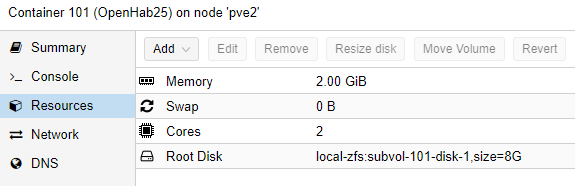

# Create OpenHAB Instance

## Create a new Proxmox Container

Click on CreateCT and choose the ressource as you please. 
Select Ubuntu as your template

I use those settings:

### Add static IP to Proxmox

With the MAC address of your created Network, you can go to OPNSense WebGUI -> Services -> DHCPv4 and add an entry to assign a fixed IP address to this instance

### Update the container

Once we logged into the newly created Ubuntu container, update everything:

update all packages with the command 

    sudo apt-get update && sudo apt-get upgrade -y

### Add a user

if the username equals your windows user, you can ssh into the system more easy.

    adduser phil
    usermod -aG sudo phil 
    mkdir /home/phil/.ssh

### Add SSH keys

you don't need username and passwords to ssh into this server if a user exists with the same name as your windows user and if your ssh-id/key is known to the server. We can simply copy it using:

    scp .ssh/id_rsa.pub phil@<ip_of_instance>:~/.ssh/authorized_keys

## Install OpenHAB

Then, follow those [instructions](https://www.openhab.org/docs/installation/openhabian.html#other-linux-systems-add-openhabian-just-like-any-other-software)

I had to install "apt install gnupg" before the installation ended successfull.

Once started, you will have to make a selection of packages. Use Standard, not Simple.

Use the commandline tool *sudo openhabian-config* to "Apply improvements"

### Enable Proxy Server

use the commandline tool *sudo openhabian-config* to install "OpenHab related" options and choose nginx as reverse proxy. I don't need user/pwd, but I want HTTPS and left the question about my IP blank. Unfortunately, all traffic then is rerouted to localhost, which is bad for non-localhost administration like I do it. So we change the file 

    etc/nginx/sites-enabled/openhab 

and

- commented the lines of server_name
- replaced the $server_name in the "return 301" section with the variable $hostname

Afterwards, restart the ngnix server using

    sudo service nginx restart

and you can access openhab using http(s)://10.0.1.2 (without the port 8080)

(tipp: your browser might cache - try incognito-mode or a different browser)

## Others

### Transformation Maps

if working with different vendors, same ideas have different notations. this is a collection of transformation map files to put in /transform:

binary.map :

    1=ON
    0=OFF
    ON=1
    OFF=0

### Autostart with proxmox

Remember to setup Proxmox to start Openhab automatically with the proxmox host. See the "Composite Setup" Section of this repository for details

### Remeber states after reboot

You probably want to keep all the states and switches as they are if openhab restarts. Then install the binding MapDB and create a file in openHAB-conf\persistence containing:

    Strategies {
        everyMinute : "0 * * * * ?"
        default = everyChange 
    }
    Items {
        * : strategy = everyMinute, restoreOnStartup
    }
