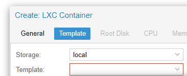
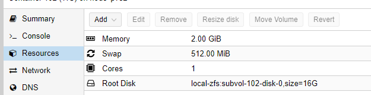

# Install TIG Instance ( Telegraf, InfluxDB and Grafana)

All loggable data should end up centralized in a big database (Here: influxDB) which then can be analyzed using a graphical interface like Grafana.

## Create a new Container

Click on CreateCT and choose the ressource as you please.
Select Ubuntu as your template

I use those settings:

### Add static IP to Proxmox

With the MAC address of your created Network, you can go to OPNSense WebGUI -> Services -> DHCPv4 and add an entry to assign a fixed IP address to this instance

### Update the container

Once we logged into the newly created Ubuntu container, update everything:

    update all packages with the command *sudo apt-get update && sudo apt-get upgrade -y* 

### Add a user

if the username equals your windows user, you can ssh into the system more easy.

    adduser phil
    usermod -aG sudo phil 
    mkdir /home/phil/.ssh

### Add SSH keys

you don't need username and passwords to ssh into this server if a user exists with the same name as your windows user and if your ssh-id/key is known to the server. We can simply copy it using:

    scp .ssh/id_rsa.pub root@<ip_of_instance>:~/.ssh/authorized_keys

## Install influxDB

See Installation [here](https://docs.influxdata.com/influxdb/v1.8/introduction/install/)

Here a little shortcut:

    curl -sL https://repos.influxdata.com/influxdb.key | sudo apt-key add -

    source /etc/lsb-release

    echo "deb https://repos.influxdata.com/${DISTRIB_ID,,} ${DISTRIB_CODENAME} stable" | sudo tee /etc/apt/sources.list.d/influxdb.list

    sudo apt-get update && sudo apt-get install influxdb

    sudo service influxdb start
    
    exit

## Install Grafana

See Installation [here](http://docs.grafana.org/installation/debian/)

## Install Telegraf

See Installation [here](https://docs.influxdata.com/telegraf/v1.14/introduction/installation/)