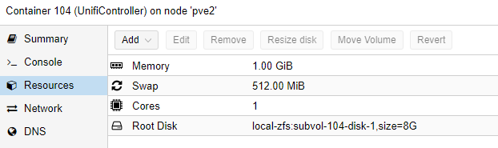

# Install UnifiController Instance

The UnifiController is the important management software that is used to administrate all unifi network devices.

## Create Container

Click on CreateCT and choose the ressource as you please.
Select Ubuntu as your template

I use those settings:

### Add static IP to Proxmox

With the MAC address of your created Network, you can go to OPNSense WebGUI -> Services -> DHCPv4 and add an entry to assign a fixed IP address to this instance

### Update the container

Once we logged into the newly created Ubuntu container, update everything:

update all packages with the command 

    sudo apt-get update && sudo apt-get upgrade -y* 

### Add a user

if the username equals your windows user, you can ssh into the system more easy.

    adduser phil
    usermod -aG sudo phil 
    mkdir /home/phil/.ssh

### Add SSH keys

you don't need username and passwords to ssh into this server if a user exists with the same name as your windows user and if your ssh-id/key is known to the server. We can simply copy it using: 

    scp .ssh/id_rsa.pub root@<ip_of_instance>:~/.ssh/authorized_keys

## Install UnifiController Software

See Installation [here](https://community.ui.com/questions/UniFi-Installation-Scripts-or-UniFi-Easy-Update-Script-or-UniFi-Lets-Encrypt-or-Ubuntu-16-04-18-04-/ccbc7530-dd61-40a7-82ec-22b17f027776)
