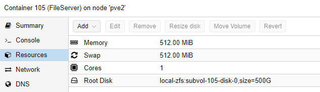

# Install FileServer Instance

A (SMB)-FileServer is a drive (with folders) that is accessable over the Network (e.g. from Windows). 

I use it to store things that aren't documents/pictures but more like disk-images, backups etc.

## Create Container

Click on CreateCT and choose the ressource as you please.
Select Ubuntu as your template

I use those settings:

### Add static IP to Proxmox

With the MAC address of your created Network, you can go to OPNSense WebGUI -> Services -> DHCPv4 and add an entry to assign a fixed IP address to this instance

### Update the container

Once we logged into the newly created Ubuntu container, update everything:

    update all packages with the command *sudo apt-get update && sudo apt-get upgrade -y* 

### Add a user

if the username equals your windows user, you can ssh into the system more easy.

    adduser phil
    usermod -aG sudo phil 
    mkdir /home/phil/.ssh

### Add SSH keys

you don't need username and passwords to ssh into this server if a user exists with the same name as your windows user and if your ssh-id/key is known to the server. We can simply copy it using: 

    scp .ssh/id_rsa.pub root@<ip_of_instance>:~/.ssh/authorized_keys

## Install FileServer Software

Nothing needs to be installed, Ubuntu already comes with an SMB Server running, we just need to configure it using 

    nano /etc/samba/smb.conf

and configure as you like, the important part is at the bottom

    #======================= Share Definitions =======================
    [phil]
        comment = Samba on Ubuntu
        path = /home/phil
        read only = no
        browsable = yes
    [proxmox]
        comment = Proxmox
        path = /home/proxmox
        read only = no
        browsable = yes

and finally,

    service smbd restart

### add users

You need to create users for each user that wants to access if you don't work with guest accounts by simple

    adduser proxmox
    smbpasswd -a proxmox
