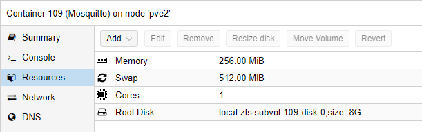

# Install Mosquitto Instance

Mosquitto is a MQTT-Broker and is used to manage MQTT-Clients, mostly IoT-Clients. 

## Create Container

Click on CreateCT and choose the ressource as you please.
Select Ubuntu as your template

I use those settings:

### Add static IP to Proxmox

With the MAC address of your created Network, you can go to OPNSense WebGUI -> Services -> DHCPv4 and add an entry to assign a fixed IP address to this instance

### Update the container

Once we logged into the newly created Ubuntu container, update everything:

    update all packages with the command *sudo apt-get update && sudo apt-get upgrade -y* 

### Add a user

if the username equals your windows user, you can ssh into the system more easy.

    adduser phil
    usermod -aG sudo phil 
    mkdir /home/phil/.ssh

### Add SSH keys

you don't need username and passwords to ssh into this server if a user exists with the same name as your windows user and if your ssh-id/key is known to the server. We can simply copy it using:

    scp .ssh/id_rsa.pub root@<ip_of_instance>:~/.ssh/authorized_keys

## Install Mosquitto Software

Can be installed with apt:

    apt install mosquitto mosquitto-clients

and can be tested with (2 different ssh-terminals)

    mosquitto_sub -h localhost -t test 
    mosquitto_pub -h localhost -t test -m "jo"

Here is a neat little script [thanks c-rieger](https://www.c-rieger.de/nextcloud-installation-mit-nur-einem-skript/) that does all the work:

    cd /usr/local/src && apt install wget -y
    wget https://it-services.c-rieger.de/s/kX56nntHoWWoPps/download -O install.zip
    apt install unzip -y && unzip install.zip
    chmod +x install.sh
    ./install.sh

I backuped a copy of this script just in case, attached here.
