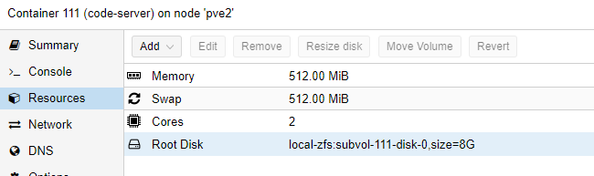

# Install CodeServer Instance

CodeServer is a WebIDE based on VS Code that runs in a browser. So we can change all the item/sitemap/rule files without installing VS Code, just in a browser:

## Create Container

Click on CreateCT and choose the ressource as you please.
Select Ubuntu as your template

I use those settings:

### Add static IP to Proxmox

With the MAC address of your created Network, you can go to OPNSense WebGUI -> Services -> DHCPv4 and add an entry to assign a fixed IP address to this instance

### Update the container

Once we logged into the newly created Ubuntu container, update everything:

    update all packages with the command *sudo apt-get update && sudo apt-get upgrade -y* 

### Add a user

if the username equals your windows user, you can ssh into the system more easy.

    adduser phil
    usermod -aG sudo phil 
    mkdir /home/phil/.ssh

### Add SSH keys

you don't need username and passwords to ssh into this server if a user exists with the same name as your windows user and if your ssh-id/key is known to the server. We can simply copy it using:

    scp .ssh/id_rsa.pub root@<ip_of_instance>:~/.ssh/authorized_keys

## Prepare OpenHab Instance

ssh into the openhab server and prepare the shared folder:

    adduser codeserver
    usermod -aG openhab codeserver
    smbpasswd -a codeserver 
    openhabian-config -> apply improvements -> fix permissions 

## Install CodeServer Software

Can be installed like this:

    sudo -i 
    apt update
    apt install curl
    curl -fsSL https://code-server.dev/install.sh | sh
    systemctl --user enable --now code-server

Let's create a local mount that is pointing to the openhab share

    mkdir /media/openhab
    echo '//10.0.1.2/openHAB-share /media/openhab2 cifs username=codeserver,password=codeserver,iocharset=utf8 0 0'>>/etc/fstab
    mount /media/openhab2

Change the binding, password etc here:

    sudo nano ~/.config/code-server/config.yaml 

## Setup the WebIDE to OpenHab

Then access the WebIDE using url:
go to Extensions and install openHAB.
Change the configuration to something like:

    {
        "openhab.itemCasing": "snake",
        "openhab.useRestApi": true,
        "openhab.sitemapPreviewUI": "basicui",
        "openhab.host": "10.0.1.2",
        "openhab.port": 8080,
        "openhab.remoteLspEnabled": true,
        "openhab.remoteLspPort": 5007,
        "openhab.username": "openhab",
        "openhab.password": "habopen",
        "openhab.karafCommand": "ssh openhab@10.0.1.2 -p 8101 -t",
    }

You can now access the openhab items in the webIDE using file->openFolder: /media/openhab2/openhab-share
