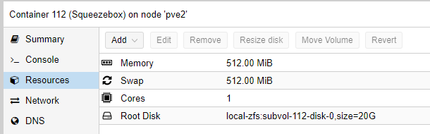

# Install Squeezebox Instance

Squeezebox is a multimedia-server that can contain your audio as well as coordinates what sounds is played on what devices.

## Create Container

Click on CreateCT and choose the ressource as you please. Select Ubuntu as your template


I use those settings:



### Add static IP to Proxmox

With the MAC address of your created Network, you can go to OPNSense WebGUI -> Services -> DHCPv4 and add an entry to assign a fixed IP address to this instance

### Update the container

Once we logged into the newly created Ubuntu container, update everything:

```bash
sudo apt-get update && sudo apt-get upgrade -y

```

### Add a user

if the username equals your windows user, you can ssh into the system more easy.

```bash
adduser phil
usermod -aG sudo phil
mkdir /home/phil/.ssh
chown phil:phil /home/phil/.ssh
```

### Add SSH keys

you don't need username and passwords to ssh into this server if a user exists with the same name as your windows user and if your ssh-id/key is known to the server. We can simply copy it using:

```bash

scp .ssh/id_rsa.pub root@<ip_of_instance>:~/.ssh/authorized_keys

```

## Prepare Squeezebox Instance

find the squeezebox install package (.deb) on google and copy the link.
ssh into the Squeezebox server and:

```bash
wget link
```

this will get you the "file".

make a snapshot/backup

```bash
sudo dpkg -i "file"
```

this will fail with dependencies. Note down those dependencies, in my case, those packages were missing:

now rollback and install those dependencies before installing logitech media server

```bash
apt install perl
apt install libio-socket-ssl-perl
```

and then :

```bash
sudo dpkg -i "file"
```

Next, we need to have some folders to play from:

```bash
sudo mkdir /media/music
sudo mkdir /media/playlists
sudo chmod 775 /media/*
```

ps: you can transfer some audia files directly with the command

```bash
scp * phil@10.0.1.10:/media/music
```

and now your done. Go to url ( <http://10.0.1.10:9000/> ) and start setting it up
