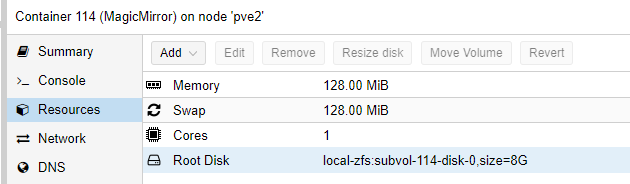

# Install MagicMirror Instance

Magic Mirror is a server that shows a website (with modules) supposed to be shown on a display behind a spy-mirror. 
We create a baseline MagicMirror Instance that can be cloned for each mirror you have in the house.

## Create Container

Click on CreateCT and choose the ressource as you please.
Select Ubuntu as your template
I use those settings: (although I recommend higher RAM during installation phase)

### Add static IP to Proxmox

With the MAC address of your created Network, you can go to OPNSense WebGUI -> Services -> DHCPv4 and add an entry to assign a fixed IP address to this instance

### Update the container

Once we logged into the newly created Ubuntu container, update everything:

    apt-get update && sudo apt-get upgrade -y* 
    apt install git net-tools curl sudo -y

### Add a user

if the username equals your windows user, you can ssh into the system more easy.

    adduser phil
    usermod -aG sudo phil 
    mkdir /home/phil/.ssh

### Add SSH keys

you don't need username and passwords to ssh into this server if a user exists with the same name as your windows user and if your ssh-id/key is known to the server. We can simply copy it using: 

    scp .ssh/id_rsa.pub root@<ip_of_instance>:~/.ssh/authorized_keys

## Install MagicMirror Software

the instructions are available here
https://docs.magicmirror.builders/getting-started/installation.html
altough at the time of writing, a change is necessary to install all dependencies:

it should not be 

    npm install

but rather

    npm install --unsafe-perm

nano /etc/environment and add the path

### the config file

the config file (/root/MagicMirror/config/config.js) has 2 sections. on top, the main parameters, like port and IP stuff. 

    var config = {
        address: "0.0.0.0",     
        port: 8080,
        basePath: "/",  
        ipWhitelist: [],
        useHttps: false,
        httpsPrivateKey: "",
        httpsCertificate: "",
        language: "de",
        logLevel: ["INFO", "LOG", "WARN", "ERROR"],
        timeFormat: 24,
        units: "metric",
        serverOnly:  true, 

at the bottom, all modules are defined. 

### Make it a service

run the command

    sudo nano /etc/systemd/system/magicmirror.service

and add this to the file

    [Unit]
    Description=Magic Mirror
    After=network.target
    StartLimitIntervalSec=0

    [Service]
    Type=simple
    Restart=always
    RestartSec=1
    User=root
    WorkingDirectory=/root/MagicMirror/
    ExecStart=/usr/bin/node /root/MagicMirror/serveronly

    [Install]
    WantedBy=multi-user.target

then run

    systemctl enable magicmirror.service

## Install the modules

We install the module manager ( https://github.com/Bee-Mar/mmpm ) first:

    sudo apt install libffi-dev nginx-full python3-pip -y
    pip3 install urllib3[secure]
    //rm /etc/nginx/sites-enabled/default
    python3 -m pip install --upgrade --no-cache-dir mmpm
    mmpm --guided-setup
