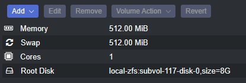

Create new container


# Install OpenVPN Access Server Instance

OpenVPN Access Server is a free Software to create and administer VPN Connections. I like it's simplicity, although it is limited to 2 users, enough for me. 

## Create a new Container

Click on CreateCT and choose the ressource as you please.

Select Ubuntu as your template

I use those settings:



### Add static IP to Proxmox

With the MAC address of your created Network, you can go to OPNSense WebGUI -> Services -> DHCPv4 and add an entry to assign a fixed IP address to this instance

### Update the container

Once we logged into the newly created Ubuntu container, update everything:
    
    sudo apt-get update && sudo apt-get upgrade -y* 

### Add a user

if the username equals your windows user, you can ssh into the system more easy.

    adduser phil
    usermod -aG sudo phil 
    mkdir /home/phil/.ssh

### Add SSH keys

generate a public/private key (no pw)

    ssh-keygen -t rsa -b 4096

you don't need username and passwords to ssh into this server if a user exists with the same name as your windows user and if your ssh-id/key is known to the server. We can simply copy from windows to the server using:

    scp .ssh/id_rsa.pub root@<ip_of_instance>:~/.ssh/authorized_keys

### Special Care needed for network card:
add those lines to the lxc conf file of your container:
(/etc/pve/nodes/pve2/lxc/<number>.conf) 

    lxc.cgroup2.devices.allow: c 10:200 rwm
    lxc.mount.entry: /dev/net dev/net none bind,create=dir

# Install openVPN Access Server

## download and install
the installation steps are available on their website:
https://as-portal.openvpn.com/get-access-server/ubuntu

you should see the ip:port link at the end that links to the config UI and provides the passwort for your login (openvpn).

in case you forgot:
cd /usr/local/openvpn_as/scripts

    ./sacli --user "openvpn" --key "prop_superuser" --value "true" UserPropPut
    ./sacli --user "openvpn" --new_pass=<PASSWORD> SetLocalPassword

## setup ports
within that config ui, go to configuration->network and 

- use the public IP of the proxy cloud server as the "hostname or IP Address"
- select TCP as the protocol
- change the "Client Web Server" - port to a number somewhere between 1025-65535. This is the port we will later tunnel into the internet. Remember it. 


## setup users

go to user management -> user permissions and add the user . Define a passwort in the details that is needed on the webui that this user retrieves his login file.

go to user management -> user profiles and create a "new profile" for that user with "autologin" enabled 


### connection from outside 
As my provider does not allow a direct connection from outside (shared DSL), I found a solution using a cloud server with a fixed IP . I initiate a reverse tunnel from my container so that all traffic to the port of the cloud server is routed through the tunnel to my openVPN access server port, which then brings the client into my network. 

## Create a host in the cloud

we need an IPv4 address, so we rent a server in the cloud that has one. Oracle has free tiers. 

### setup firewall rules
we need to ensure that the port we want to (defined above) is not blocked by the cloud's firewall. 
for oracle, that is in here: 

    Networking ->    Virtual cloud networks ->   <yourCloudNetworkName> ->
    Security List Details ->     "ingress" option


### enable remote login to external IP Host
ssh to remote server and place the public key in root/.ssh/authorized_keys

## build the tunnel

### setup the tunnel connection

create crontab to start the tunnel on boot:

    crontab -e

and now we let that server reroute the port we defined earlier. (outside_port and inside_port both are the port we have defined in the access server network options)

```bash
    # m h  dom mon dow   command
    @reboot autossh -M 0 -f -o ConnectTimeout=10 -o ServerAliveInterval=60 -o ServerAliveCountMax=2 -N -R <outside_port>:localhost:<inside_port> <user>@<serverIP>
```
## Connect a device
### on Iphone
we download the openVPN app, press the 'add' button, connect to the local instance IP address (we are still on the same, local network). 

using the credentials defined above for the user, we can add the profile with auto-login enabled. Just define the optional port with "our" port. 
