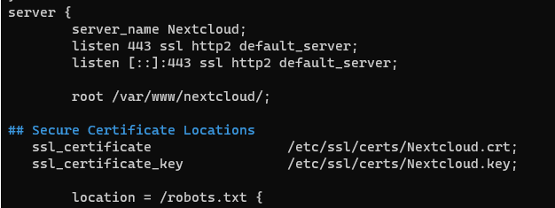

# Certificates

Having digital certificates enables secure communication between the devices as well as makes authentication easier. 
At the end, we will use it to communicate via https to our servers and we will use certificates to authenticate on the VPN. I am going to use Opnsense's build in certificate manager to manage those certificates.

A good documentation is available [here](https://docs.opnsense.org/manual/how-tos/self-signed-chain.html).

## How to implement them

### Proxmox

TODO

### for VMWare Hypervisor

Go to the VMware Hypervisors Webinterface->manager->security->certificates and import a new certificate. Click on generate IP signing request and copy/paste that code into your pfsense' Certificate manager->add option: sign a CSR. Download the created cert, open with notepad and copy&paste that content back to the hypervisor's webinterface.

### in OPNSense

in the Webgui -> System -> Settings -> Administration

### OPENHAB

Copy the content of your key and cert (downloaded from the pfsense Cert Manager ) into the files /etc/ssl/certs folder, overwriting existing openhab.cert and openhab.key files.
Then, restart nginx using sudo systemctl restart nginx.service

### UnifiController

There is this [website](https://help.ui.com/hc/en-us/articles/212500127-UniFi-SSL-certificate-error-upon-opening-controller-page) but I didn't get it to work .

### Nextcloud

Copy the content of your key and cert (downloaded from the pfsense Cert Manager ) into the files /etc/ssl/certs folder. 
Then, add those 2 lines into /etc/nginx/conf.d/nextcloud.conf

Then, restart nginx using sudo systemctl restart nginx.service
