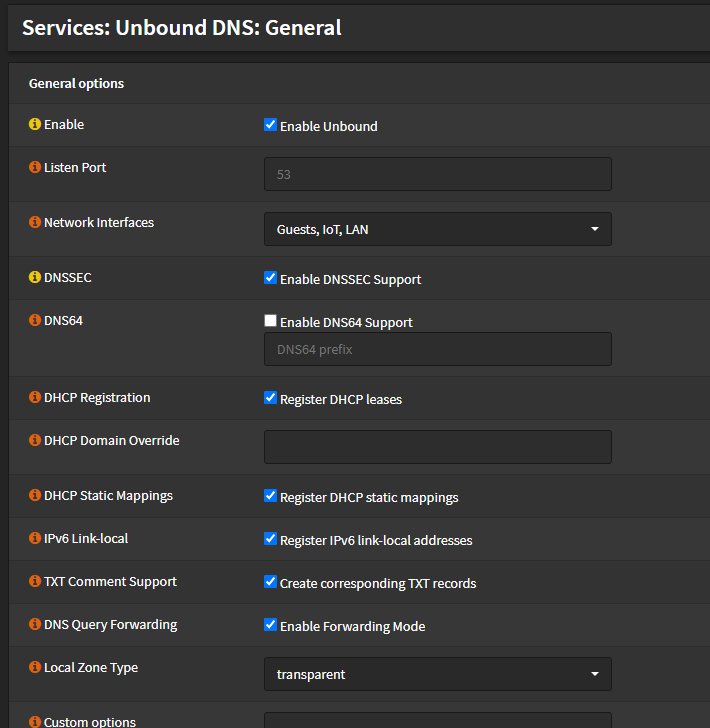

# DNS Overrites

DNS (name/alias instead of IP-adress) can be used to quickly access your services without memorizing the IP-Adresses.

I will use it for 2 reasons.

- have an alias for the proxmox main server (which mostly is the main, but sometimes it is the spare that has a different IP). If I add a new proxmox server, the main will become the spare etc. and therefore the real hostnames are just numbers. (yes, you could change the hostnames instead, but in some cases - here proxmox - this is not recommended )
- block adverisments requests (ads on websites).

## Prepraration

The Service "Unbound DNS" must be installed and enabled in the firewall. Login to the main menu of OPNsense (10.0.0.1) -> System -> Firmware -> Packages and install the Unbound DNS package. ( Might already be installed). You will find it afterwards in the Menu -> Services -> Unbound DNS.
Enable it:

## Alias for IPs

Go to the override subsection and create a new account for each override you want to do:

## Block adverisments in the network

Todo