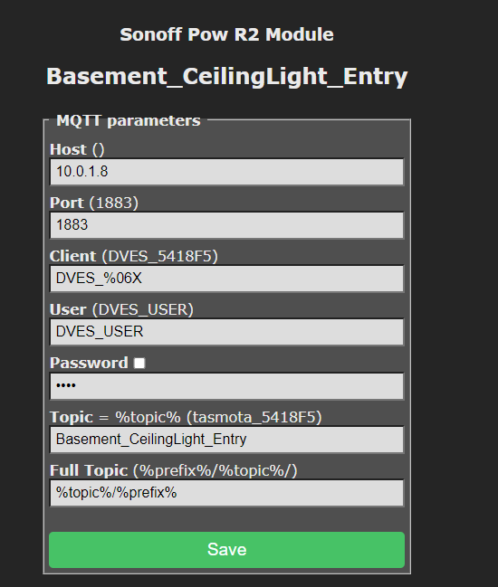
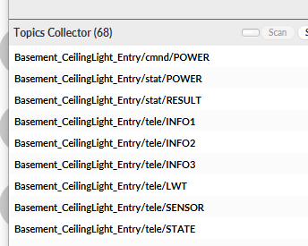
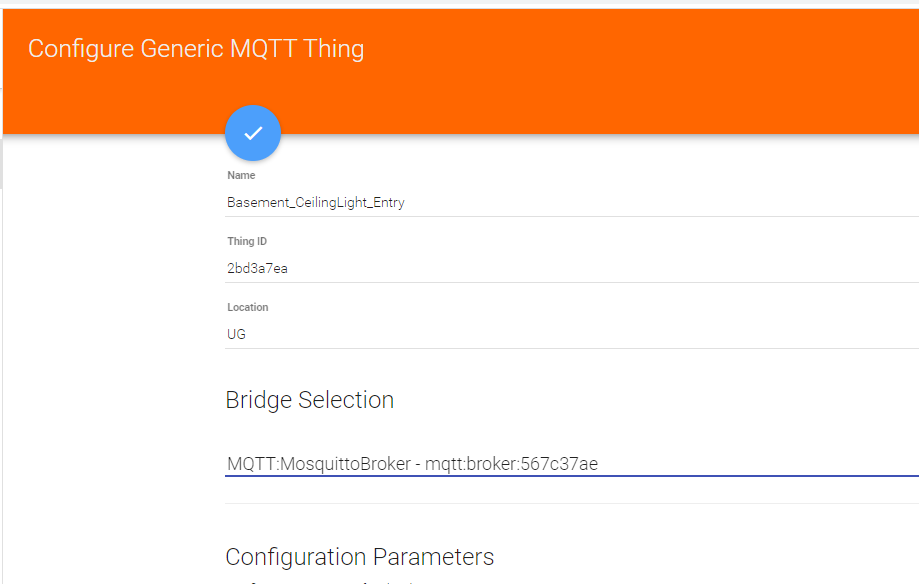
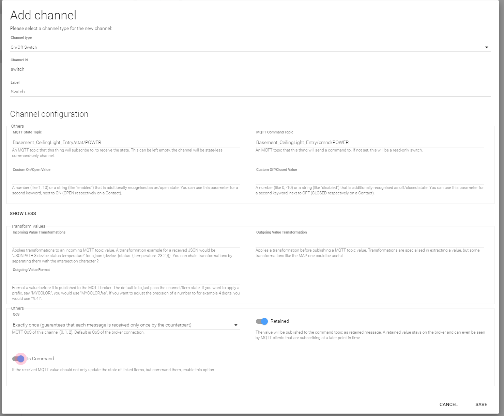
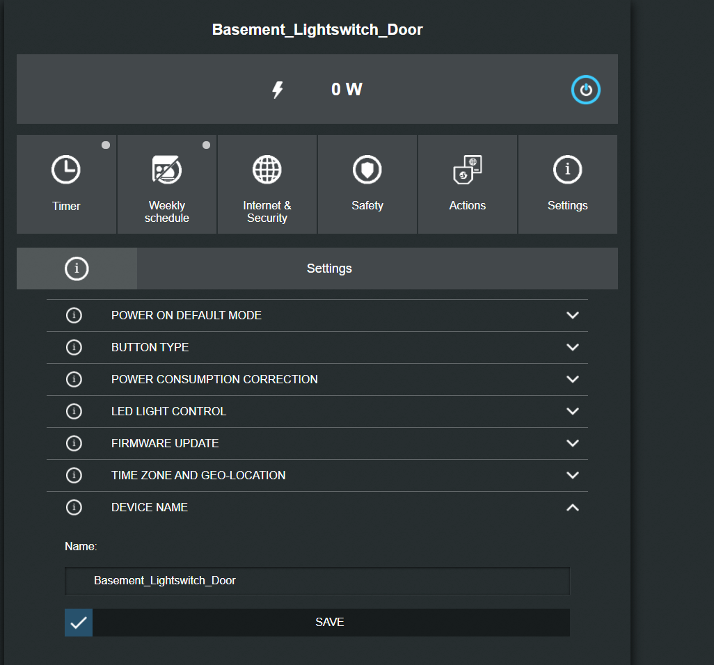
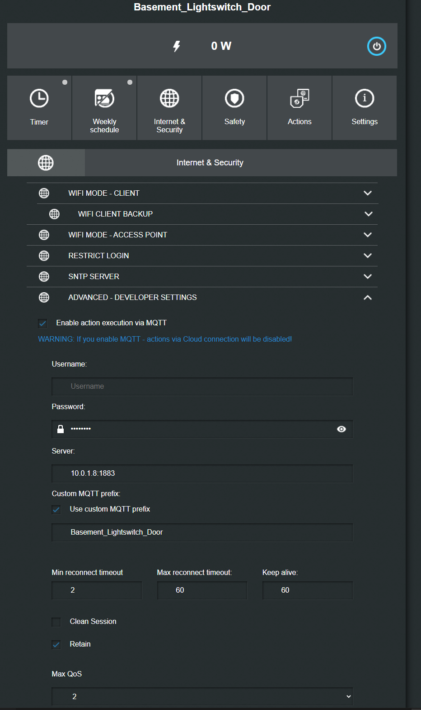
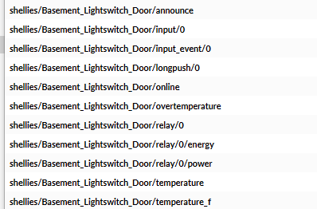
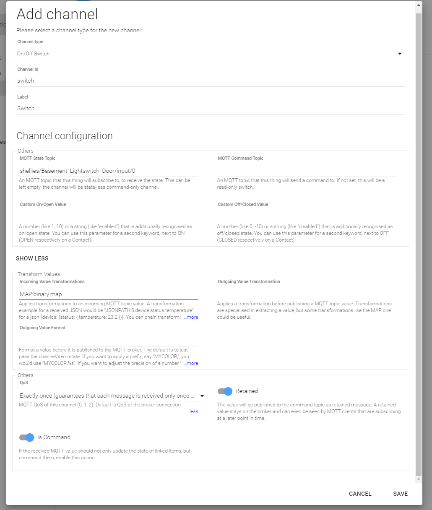

# Adding MQTT devices

Many (open) devices have MQTT support. I prefer MQTT over other protocols because they ensure every command is received exactly once at the target, even if it is offline (if that is requested, like roller shutters for example) as well as the simple way to monitor it.

Depending on the brand/firmware of the devices, there are different setups:

Prerequisition:

- The device is already on the network and has an IP address.
- Firewall approves the connection from the device to the MQTT server

Tip: Start MQTT.fx and monitor/scan all traffic before and while you connect the device to understand it's communication structure

## Tasmota

If the device is running tasmota, go to the configuration tab:

- configure others

- configure MQTT ( Host cannot be a DNS name, must be IP)

### Sonoff Pow R2 Module

in MQTT.fx, you can see:

first, we create the thing for the device
openhab-ui->configuration->things->mqtt->generic

and we add channels for each function we want/need/get

- Switch:

next, we create the items for each topic

    Group G_Basement_CeilingLight_Entry "Kellerlicht Eingangsbereich"
    
    Switch Basement_CeilingLight_Entry_Switch "Schalter Kellerlicht Eingangsbereich" <light> (G_Basement_LightsSwitches, G_Basement_CeilingLight_Entry) [ "Lighting" ] {channel="mqtt:topic:2bd3a7ea:switch"}

and finally, add the item to a sitemap

    sitemap basement label="Keller" {
        Frame label="Licht" {
            Switch item=Basement_CeilingLight_Entry_Switch   
        }

## Shelly

Define a base name:

and set the mqtt parameters:

### Shelly1PM

in mqtt.fx you see:

first, we create the thing for the device
openhab-ui->configuration->things->mqtt->generic

and we add channels for each function we want/need/get

- Switch:

next, we create the items for each topic

    Group G_Basement_Lightswitch_Door  "Schalter Steckdosen am Eingang" (G_Basement)

    String Basement_Lightswitch_Door_Switchstatus    "Schaltzustand Steckdose am Eingang [MAP(binary.map):%s]" <switch> (G_Basement_Lightswitch_Door) {channel="mqtt:topic:c111667c:switch"} //we cannot physically switch from openhab - therefore, read only = String. 

and finally, add the item to a sitemap

    sitemap basement label="Keller" {
        Frame label="Schalter" {
            Group item=G_Basement_Lightswitch_Door   
        }

## EasyESP
