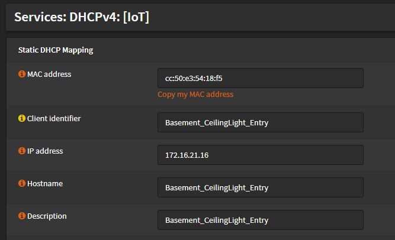

# TCP / IP based devices

## Make connection 

if the devices is connected via cable, plug it in to a port that is assigned to the (sub-)network you want the device to be connected to. You can select that in the unify controller (https://unify) in the devices tab on the switch that you want to plug the new device in.

if the device is connected wirelessly, supply the credentials matching the (sub-)network you want it to connect to. (credentials available in the unify controller (https://unify) under settings-wireless networks).

the /etc/wpa_supplicant.conf should look like this:

    network={
        ssid="ssid_name" //e.g. "IoT_OG"
        psk="password"   //
    }

## Define an IP-address

when the device is powered on and connected to the network, it will appear in the unify client overview page. (tip: sort by uptime).

Go to the PFsense administration menu->Services->DHCPv4->Leases and you should find the device at the range for new dhcp clients.
click the Plus-symbol to define a static IP address.

I have IP ranges mostly based on vendors, but grouping is mostly necessary for easier firewall rules.
