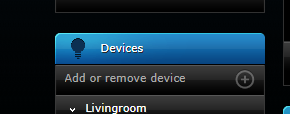
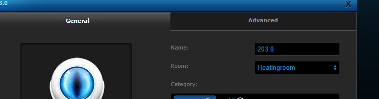
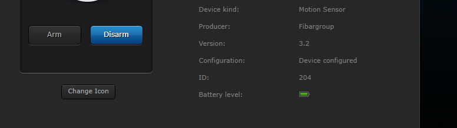
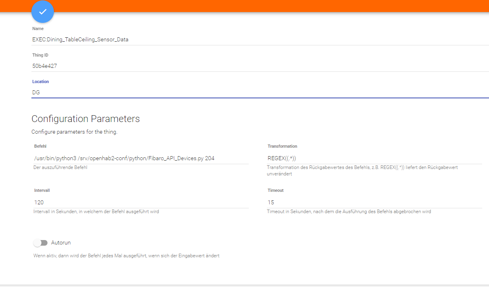
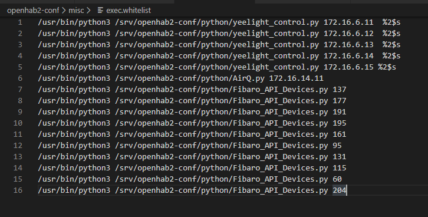
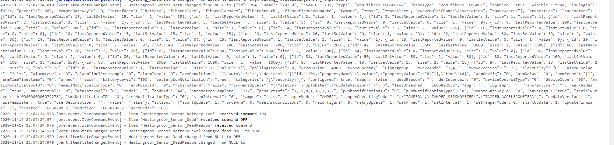

### Adding new Z-Wave device

open Fibaro Home Center Admin Console,
select device tab
press + to add new device and click add for the type of device you want to add. (e.g. the "add" next to the card board box.)

press the button on the device like in the description . (e.g. 3 times)
be patient - a text should indicate some progressing. Window will disappear. 
    if not, delete whatever has been created (under Unassigned) and try again
go to the device section, the new item channels are displayed under "Unassigned"
change the room, makes live easy

identify the device id:

add new exec binding thing using and set the path to the python script supplying that device id (see screenshot)

check the logs, it should bring up error

    nding.exec.internal.handler.ExecHandler] - Tried to execute '/usr/bin/python3 /srv/openhab2-conf/python/Fibaro_API_Devices.py 204', but it is not contained in whitelist.

first, add the items for the device in openhab items file (replacing the exec command id with the one you just created, make sure the Capitals are right etc. See details in the install part 3 Dependencies-Setup/Z-Wave Connectivity

        Group G_Heatingroom_Sensor "Sensor Heizungsraum" (G_FibaroDevices)
        String  Heatingroom_Sensor_Data           "SensorHeatingRoom Json-Data [%s]" (G_Heatingroom_Sensor,G_FibaroDevices_Data) {channel="exec:command:50b4e427:output"}
        Number  Heatingroom_Sensor_BatteryLevel   "Batterie Ladestand im HeatingRoom [%d %%]"   (G_Heatingroom_Sensor,G_BatteryDevices)          ["Battery", "Measurement"]    
        Switch  Heatingroom_Sensor_Dead           "Verbindung zum Sensor im HeatingRoom:[%s]"  (G_Heatingroom_Sensor,G_FibaroDevices_Alert_Dead)  
        String  Heatingroom_Sensor_DeadReason     "Dead Reason:[%s]"  (G_Heatingroom_Sensor)   

Now add the device id to the script whitelist:

wait until the exec is executing again (interval settings like 120 sec in the picture). The log should show something like this:

