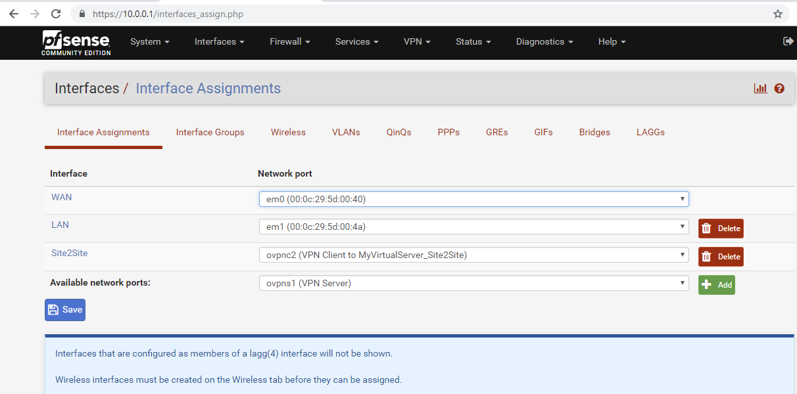
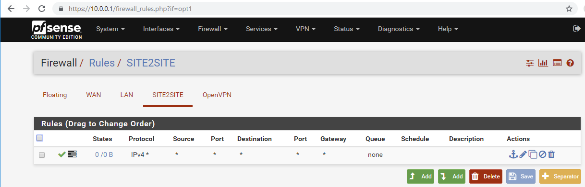

## Indirect Method: connect via a cloud instance 
As mentioned above, this is my fallback scenario because my ISP does not have any IPv4's left and shares one IPv4 Address to multiple customer -> no one can directly connect. I will therefore initiate a VPN connection "from" my home network to a cloud server that has a fix address. Any client's fallback option will be that cloud server that routes the traffic from authenticated client into the home network. 

### Get a cloud server              
I need a fixed IP-Address to where I can connect from anywhere. I rent the nano server at [myvirtualserver.com](https://www.myvirtualserver.com) for 15€/year.

### Create OpenVPN Server 
Once logged in to the cloud server's ssh console, run 

    sudo apt-get install openvpn

Next, we need a server-config. Let's copy the one we just created using pfsense's  function and browse to . Let's copy the content of the conf file and the tls-auth file to our server.

### Copy config files to server
I use the command line text editor nano on the server.

    sudo apt install nano

then copy the content of important files from the pfSense box to the server. On the pfSense box, navigate to menu->diagnostic->edit file and browse to /var/etc/openvpn. This is where we open the file server1.conf and copy all the content. Back to the Server's ssh console and 

    sudo nano /etc/openvpn/MyVirtualServer_VPN_Server.conf 

and paste (right mouse click) the content from the server.conf file form the pfSense server.

I do the same for the pfsense file "/var/etc/openvpn/server.als-auth"

    sudo nano /etc/openvpn/MyVirtualServer_VPN_Server.tls-auth

Additionally, create certificates for the Server (2 files) and grab the content of your CA.cert file and copy those contents to the server

    sudo nano /etc/openvpn/MyVirtualServer_VPN_Server.key 
    sudo nano /etc/openvpn/MyVirtualServer_VPN_Server.cert
    sudo nano /etc/openvpn/OpenHouseCA.cert

Your directory should looke like that:

    root@MyVirtualServer:/etc/openvpn# ls -l
    -rw-r--r-- 1 root root  431 Nov 18 10:53 MyVirtualServer_VPN_Server.dh2048
    -rw-r--r-- 1 root root 2097 Nov 18 10:48 MyVirtualServer_VPN_Server.crt
    -rw-r--r-- 1 root root 1201 Nov 18 13:53 MyVirtualServer_VPN_Server.conf
    -rw-r--r-- 1 root root 3323 Nov 18 10:48 MyVirtualServer_VPN_Server.key
    -rw-r--r-- 1 root root    0 Nov 18 13:46 MyVirtualServer_VPN_Server.log
    -rwxr-xr-x 1 root root  369 Nov 18 13:55 MyVirtualServer_VPN_Server.sh
    -rw-r--r-- 1 root root  653 Nov 18 10:48 MyVirtualServer_VPN_Server.tls-auth
    -rw-r--r-- 1 root root 1843 Nov 18 11:00 OpenHouseCA.crt
    -rw------- 1 root root 3706 Nov 18 15:00 vpn_server.log

### Adjust authorization check
Small adjustments are necessary compared to the file from pfSense. We don't have the same local database for the VPN users. I use this [script(MyVirtualServer_VPN_Server.sh)](MyVirtualServer_VPN_Server.sh) to check the credentials, store in /etc/openvpn/MyVirtualServer_VPN_Server.sh and make it executable 

    sudo nano /etc/openvpn/MyVirtualServer_VPN_Server.sh
    sudo chmod +x /etc/openvpn/MyVirtualServer_VPN_Server.sh

... I agree, this can be improved (TODO).

### Clean up pfSense specific settings
pfSense has some extra features that we don't need, so we clean up those unwanted things and your server.conf would look like [this(MyVirtualServer_VPN_Server.conf)](MyVirtualServer_VPN_Server.conf)

### Enable the OpenVPN Server
try to run the server: 

    sudo systemctl start openvpn@MyVirtualServer_VPN_Server

errors can be seen immediately and in the file vpn_server.log

To have this server running automatically after a system start:

    sudo systemctl enable openvpn@MyVirtualServer_VPN_Server 

### Create pfSense Client
Next, we want pfSense to connect to our cloud instance and bridge it to our LAN.

We create a client setting on pfSense:

I have my [config file](pfsense_Client.conf) uploaded as well.

It will immediately try to connect, you can see the success in the status page:

We assign an interface

We bridge that interface to our LAN

We adjust the firewall

### Modifiy your Client OVPN
At the end, we add our indirect method to our existing client-config file (right click on the task-bar icon of openVPN, change configuration and dublicate the line remote... using the fixed IP address of the cloud server.
We also remove the line verify-x509 because we have to different certificates. The client config looks similiar to [this(client.ovpn))](client.ovpn)

## Try it:
If we now shut down (or set a firewall rule or anything to prevent) the direct connection, your client-software (using client.ovpn) will connect to the cloud server after a timeout. 
you will receive an IP address from that cloud instance VPN Server but all you traffic to 10.0.0.0/16 would go to that cloud server and rerouted into our home network (and vice versa). It will be 30+ms slower, but it works.