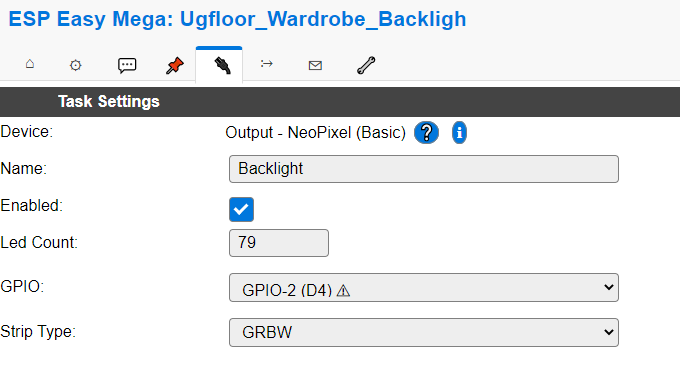

# Colorful backlit Wardrobe

## Hardware

### Build some wood

### Add some electronics

I used a WEMOS D1 mini for this project.

Sorry, forgot to make a nice picture before I put it on the wall:

it should be something like:

## Software - 8266

### Flash ESPEasy to the 8266

First, connect the ESP8266 via USB. Then, download and start the flash-tool:[download here](https://github.com/letscontrolit/ESPEasy/releases)
and choose the firmware matching to your need, e.g. *normal_*4096.bin

You can then connect to a new WIFI-Access Point and start configuration

### Setup basic information

important values are:

- Wifi SSID and Password
- unit name (I prefer no number)
- Client IP block Level

### Enable MQTT

go to controllers and ADD the HomeAssistant(openHAB)MQTT controller:

### Enable NeoPixel

go to devices and Add the NeoPixelDevice, give it a name and assign the GPIO of the data cable as well as the amounts of leds you have.

## Software - OpenHAB

### Create a thing in OpenHab

Create a generic MQTT Thing with a color-channel:

### Create an item in OpenHab

Create item for that channel:

### Create a control in OpenHab

Create a sitemap with a control widget for that color-item:

And now, everytime you change the value of the item, it will post the "NeoPixelAllHSV" command with added color,saturation,brightness values to the broker.

## Additional Informations

- EasyESP Neopixel code is available [here](https://github.com/letscontrolit/ESPEasy/blob/mega/src/_P038_NeoPixel.ino)
- EasyESP tutorial for working with rules is available [here](https://www.letscontrolit.com/wiki/index.php/Tutorial_Rules)
