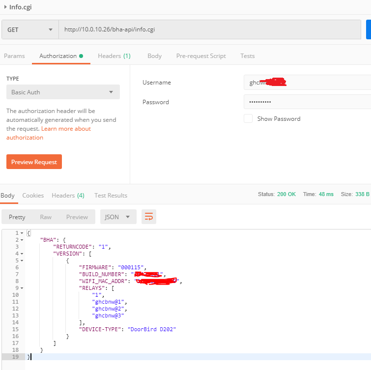
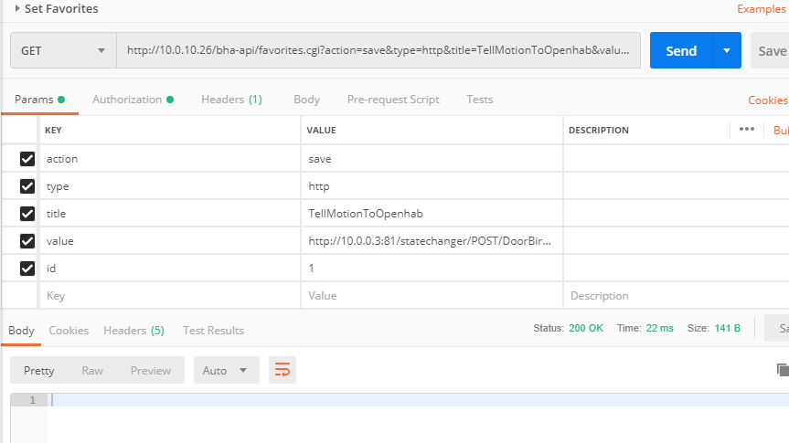
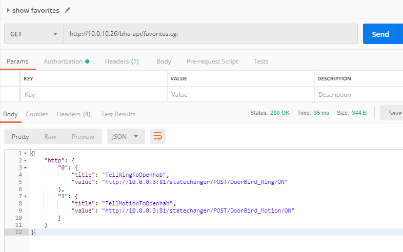
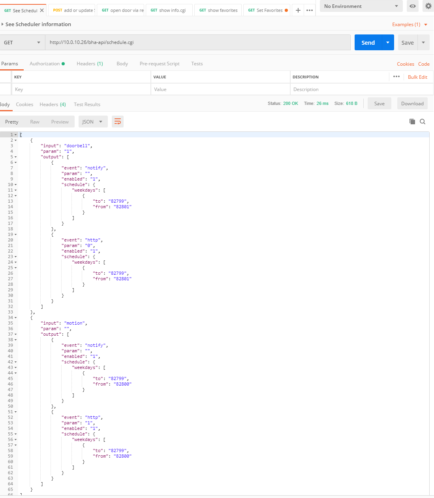

# Install Video Station
Installation of the devices is pretty simple with the attached manual. You plug in into your network, start the app and use the credentials from inside the box to set it up. 

Current limitations are: 
- You need to have a video station in order to control the E/A Controller. The E/A Controller cannot be controlled without the video station
- You need internet access. The current solution does not work offline as intended, you require internet access to "their" server for the initial setup as well as for any kind of push-messages. 

## Setup of VideoStation
Star the app, enter the admin-credentials from the letter inside the box. 

Next, create some users. I added my wife, myself and a user for openhab. The permissions-settings allow further specifications, I removed the relays that I don't need via permissions.

I enabled the 3D Motion sensor .

## Setup of the EA Controller
Star the app, enter the admin-area of the Doorbird Video station. Go to the settings for peripherals and add the controller using the credentials from inside the box. 

## Finalize and Verify Installation
To ensure that everything is set up correctly use a tool like postman to communicate with the DoorBirds API:

### Show the info.cgi:
it should list the doorbird's firmware, Build Number etc as well as all connected relays. You need to remember the Relay ID (ghcbnw@1 for relay on of my EA Controller) for step "open the door relay".

### open the door relay
set a (GET!) request to the open door cgi will trigger the requested releay:

### set favorites
you can use the favorite.cgi API to create and list favorites. the Creation can also be done in the APP.

You can list them then using the GET request:

### set schedules
you can see current "actions" (called schedules) using the schedule.cgi API:

To add a new action, you post the action into the schedule.cgi, but should include existing actions, otherwise they will be deleted. 

 

# OpenHab settings
The following functions are available in openhab:
- receives rings signal
- receives motion trigger alarm
- sends "open the door"-signal
- shows current config (info.cgi, schedule.cgi, favorites.cgi) (todo)
- turn on the light  
- restart the revice 

Code can be reviewed in the attached sitemap, items and rules files. 

## OpenHab statechanger 
I had to improvise here because DoorBird does not support POST or PUT requests in their favorites, only GET, and no https (at least for my own certificates)! So I added this section in the openhab's /etc/nginx/sites-enabled/openhab file:

    ## http_fallback_port (some apps like doorbird do not support https...)
    server {
        listen                           81;
        server_name                      10.0.0.3;

    location ~ /statechanger/POST/([^/]+)/([^/]+) {
        proxy_pass https://10.0.0.3:8443/rest/items/$1;
        proxy_method POST;
        proxy_set_body $2;
    }

    location ~ /statechanger/PUT/([^/]+)/([^/]+) {
        proxy_pass https://10.0.0.3:8443/rest/items/$1/state;
        proxy_method PUT;
        proxy_set_body $2;
    }
}

# Synology settings
Connecting to a synology disk station (or other types of video recording/managing devices) is also pretty simple as the doorbell camera does support the ONVIF protocoll. I attached the manual specific to Synology, all available documentation is read [here](https://www.doorbird.com/de/connect)

# Firewall settings
(TODO)

