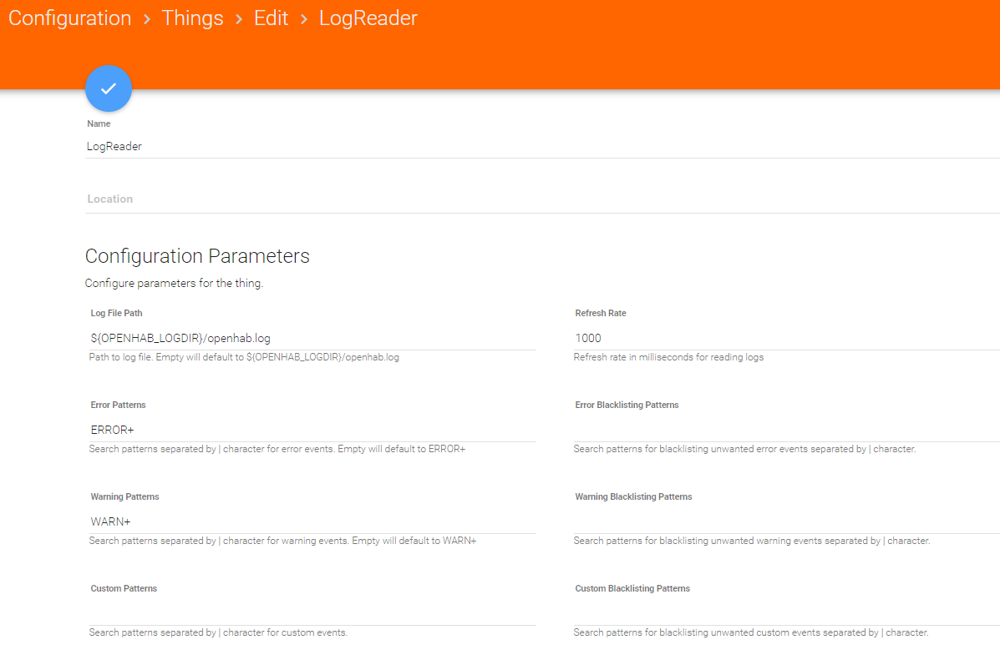

# Receive Errors and Warnings via Telegram

It is helpful to know when things don't go according to plan. A good way to receive those information is to install the logreader binding, that can act on error and warnings that appear in the openhab-log.

## Install the binding

The binding is called [logreader](https://www.openhab.org/addons/bindings/logreader/)

Create a new thing with from the binding, one thing is enough as you probably only have one log file. One thing per file.



The instructions on the binding documentation are complete.

### Setup

I have created those items:

```java
    Group G_Logreader
     DateTime LogreaderLogRotated        "Last Log Rotation [%1$tY.%1$tm.%1$te %1$tR]"   <time>  (G_Logreader) { channel="logreader:reader:40651226:logRotated" }
     Number   LogreaderErrors            "Error events matched [%d]"                     <alarm> (G_Logreader) { channel="logreader:reader:40651226:errorEvents" }
     String   LogreaderLastError         "Last error [%s]"                                       (G_Logreader) { channel="logreader:reader:40651226:lastErrorEvent" }
     Number   LogreaderWarnings          "Warning events matched [%d]"                   <alarm> (G_Logreader) { channel="logreader:reader:40651226:warningEvents" }
     String   LogreaderLastWarning       "Last warning [%s]"                                     (G_Logreader) { channel="logreader:reader:40651226:lastWarningEvent" }
     Number   LogreaderCustoms           "Custom events matched [%d]"                    <alarm> (G_Logreader) { channel="logreader:reader:40651226:customEvents" }
     String   LogreaderLastCustom        "Last Custom [%s]"                                      (G_Logreader) { channel="logreader:reader:40651226:lastCustomEvent" }

```

I have added the items in my admin sitemap:

```java
Frame label="openHAB Log Reader" {
    Text item=LogreaderErrors
    Text item=LogreaderLastError
    Text item=LogreaderWarnings
    Text item=LogreaderLastWarning
    Text item=LogreaderCustoms
    Text item=LogreaderLastCustom
    Text item=LogreaderLogRotated
}
```

and i have the rule that will send errors and warnings via telegram:

```java
rule "LogReader Error events"
when
    Channel 'logreader:reader:40651226:newErrorEvent' triggered
then
    val telegramAction = getActions("telegram","telegram:telegramBot:bot_phiL")
    telegramAction.sendTelegram( "*ERROR* LogReader Event!\n%s Errors are in the log! Here is the last row of it:\n`%s`", LogreaderErrors.state.toString, LogreaderLastError.state.toString)
end


rule "LogReader Warning Events"
when
    Channel 'logreader:reader:40651226:newWarningEvent' triggered
then
    val telegramAction = getActions("telegram","telegram:telegramBot:bot_phiL")
    telegramAction.sendTelegram( "*WARNING* LogReader Event!\n%s Warnings are in the log! Here is the last row of it:\n`%s`", LogreaderWarnings.state.toString, LogreaderLastWarning.state.toString)
end
}
```
