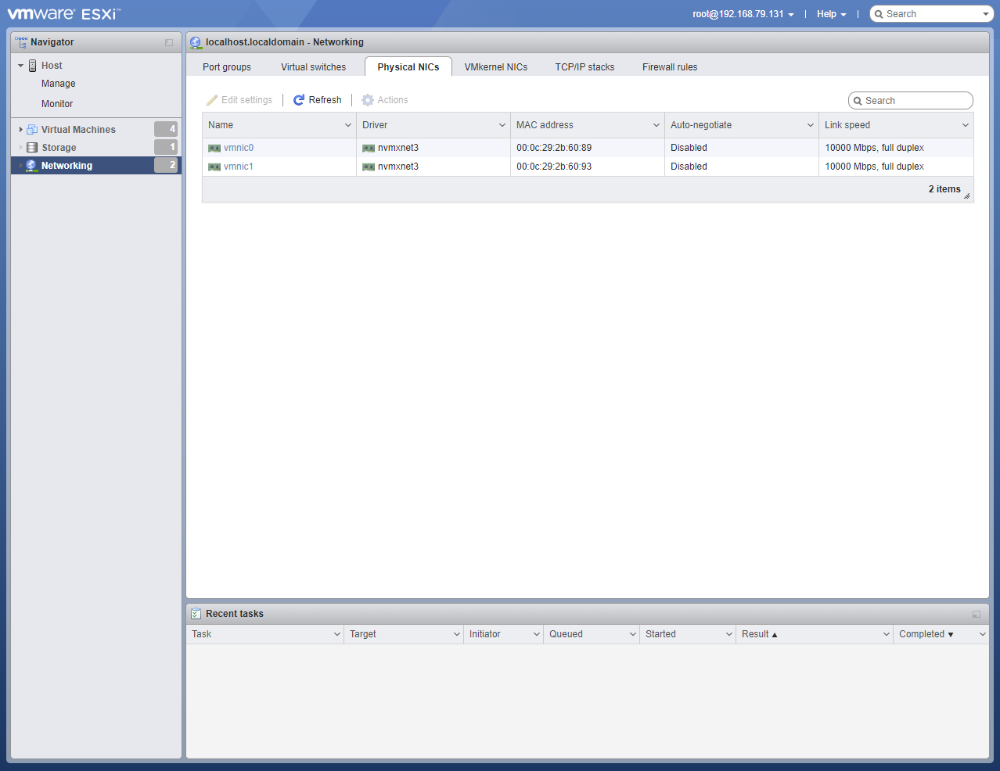
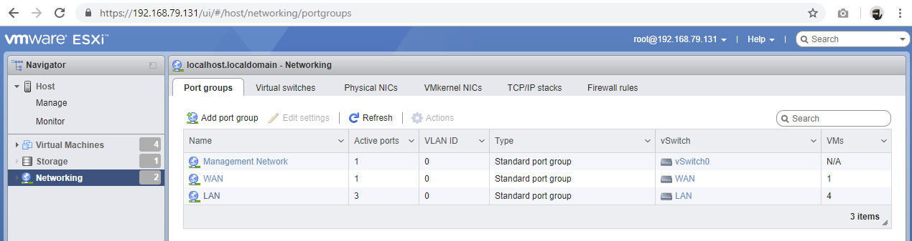

## Create VMWare vSphere Hypervisor Instance
 Download the [VMware vSphere Hypervisor's ISO file](https://my.vmware.com/en/web/vmware/evalcenter?p=free-esxi6) (yes, you need to get an account and with it you get a free license).
 Start the previously installed VMware Player, create a new virtual machine and choose the ISO file of the VMWare vSphere you just downloaded. It will auto-detect. All you have to choose is what kind of hardware you are going to "simulate". I suggest to use something similiar to the hardware you plan to use, so make it realistic in case of disc space, CPUs (not threads!), memory usage and network ports.
 In my case, I installed it with 1 CPU, 8GB of Ram, 100GB Disc space and 2 Network ports. ( Configure the network so that the first network port is host-only and the second network port ist bridged. )

 Power it up. Going throught the Installation is pretty forward.  Afterwards, you should be able to use a browser to connect with the hypervisor's webinterface afterwards, the IP is shown in the VMWare Player, username is root without password.

### Networking on the VMware Hypervisor
Let's start with the "Network" Menu. 
- Tab: physical NICs
    - you should have 2 nics, otherwise go back to the settings of your VMware player.
    
- Tab: Virtual Switches
    - Create WAN - ensure that Uplink1 is linked to vmnic1.
    - Create LAN - no uplink
    
- Tab: Port Groups
    - Create WAN and assign to switch WAN
    - Create LAN and assign to switch LAN
    - Remove VM Network
    
